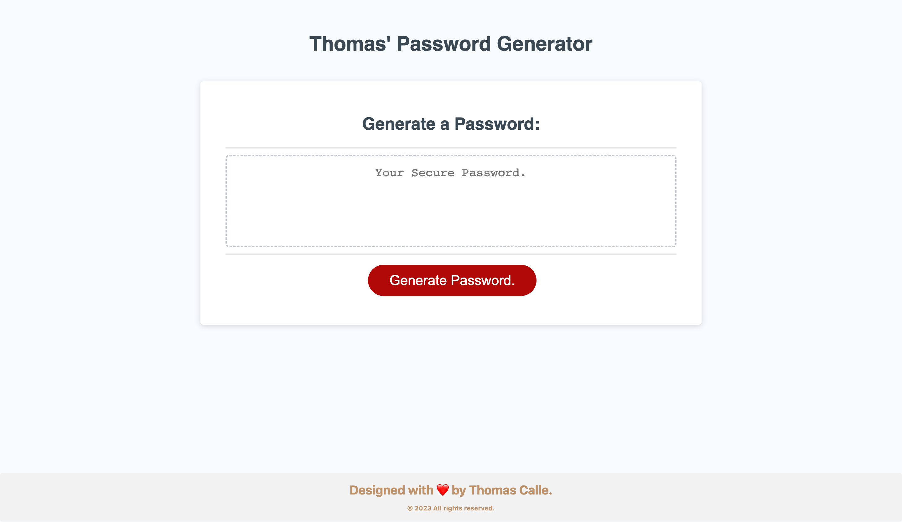

# Thomas' Password Generator

## Description

Thomas' Password Generator

It does exactly what you though it does, it generates passwords - but how? Based of the criteria provided into the generator professionals, consumers, clients and employers alike will be able to use this application to 'generator a password' so have fun at it and take a go out! Be sure to read the rest of the README.md to see the criteria specified.

## Table of contents

- [Overview](#overview)
- [The challenge](#the-challenge)
- [Screenshot](#screenshot)
- [Links](#links)
- [My process](#my-process)
- [Built with](#built-with)
- [What I learned](#what-i-learned)
- [Continued development](#continued-development)
- [Author](#author)
- [Acknowledgments](#acknowledgments)


## Overview

### The challenge

This week's Challenge requires me (Thomas Calle) to modify a provided UofT bootcamp HTML & CSS starter code... to create an application that enables employees to generate random passwords based on criteria of their choice. The application will features dynamically updated HTML and CSS powered by own fully written JavaScript(not the bootcamps JS my JS so let's make that clear) code... and will have an adaptive responsive web sight design.

## The Password Generator will give the use the option to choose the following:
```
- Length: at least 8 characters and no more than 128 characters
- Character Type: lowercase, uppercase, numeric, and/or special characters
- Confirm: validate at least one of the above character types
```

### Screenshot



### Links

- Solution URL: [Solution URL]


## My process

I initialized and configured a GitHub repository to maintain version control for this project. The project utilizes GitHub pages to easily publish this project for others to view. 

Once initiated, my goal was to establish my plot into JavaScript(JS) as it was the main focus to complete and add JS into a HTML & CSS starter code. First entry, established the constant variable query selectors - then the password criteria for the characters: lower case, upper case, numerical, and special characters... these were established as var with the appropriate range of character amounts of each choice listed within the "var choosenCharacter = "";" (take note kids, this will help you in the future).

From there the reall complicated stuff begins.... The function starts to initialize the "result" then it prompts the user for the length of the password (in characters) using "prompt()". If the input is not a a valued number aka. anything mentioned outside the established parameter of "8 to 128 characters" if it is given outside those bounds then a error message is displayed through "alert()" the function will then call it again using the "return generatePassword()". 

From here the "confirm()" will ask to include the following; upper case letters, lower case letters, numbers, and special characters - this will be inputed into the newly generated password of preference and will be shown in the generated password box on screen. Now the most important part of this is the "if" part ... "if" you(the user) selects none of the presented options on screen then you will be promted with an error code message - the error message will display - then the function will call everything again.

Once the fucntion calls everything again, you (the user) will have to repeat the sequence again, until you meet mandatory requirment... 1. desired length within parameter has been chosen. 2. a minimum of 1 out of 4 character options were chosen. After both 1 and 2 have been completed the password will be generated in presented in the box on screen.
  
Note: Please, do take your time to review my process... as a new beginer in JavaScript the process was difficult for me. I have left some key notes and pointers in the process and some within the JavaScript file.
----

### Built with

- Starter code HTML & CSS
- Dynamic JavaScript (from scratch)
- Updated CSS custom properties
- Updated HTML custom properties
- Comments - clear indicators and point reference marks
- Images, sourced locally, images/photos created by the author(Thomas Calle)

### What I learned

I learned how to build dynamically formated JavaScript catering towards a client themed demand - that being I was provided with UofT bootcamp starter code HTML & CSS with a Mockup and criteria ... this forced me to go out of my comfort zone by catering to the needs of others as the objective was specified and the visual design was given and is expected no matter what. The process of this created many obstacles - as it is always easier to go off 'personal preference' as building your own starter code with your own preference does not limit you. 

### Continued development

The next step of journey, involves a few endless nights here and there doing whats nescessary to catch up on my foundational JavaScript to push the envelope further - practice makes perfect.


## Author

-[My Portfolio Site](https://github.com/ThomasCalle)


## Acknowledgments
Thank you, goes out to those who have taken the time acknowledge my work and progress - I can't wait to take things up a notch. 